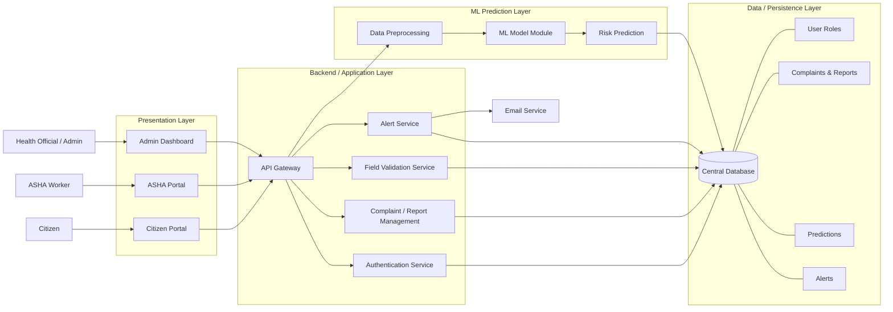

# System Architecture Diagram



This diagram matches your project better:

- `Citizen Portal` maps to the local user pages and complaint flow.
- `ASHA Portal` maps to ASHA login, prediction, and complaint tracking.
- `Admin Dashboard` maps to admin login and admin reports.
- `Complaint / Report Management` covers complaint submission and viewing.
- `ML Prediction Layer` represents the saved model and scaler used in prediction.
- `Email Service` represents the alert emails sent after medium or high risk predictions.

Use this version if you want a clean, easy-to-explain system architecture for your report.
```