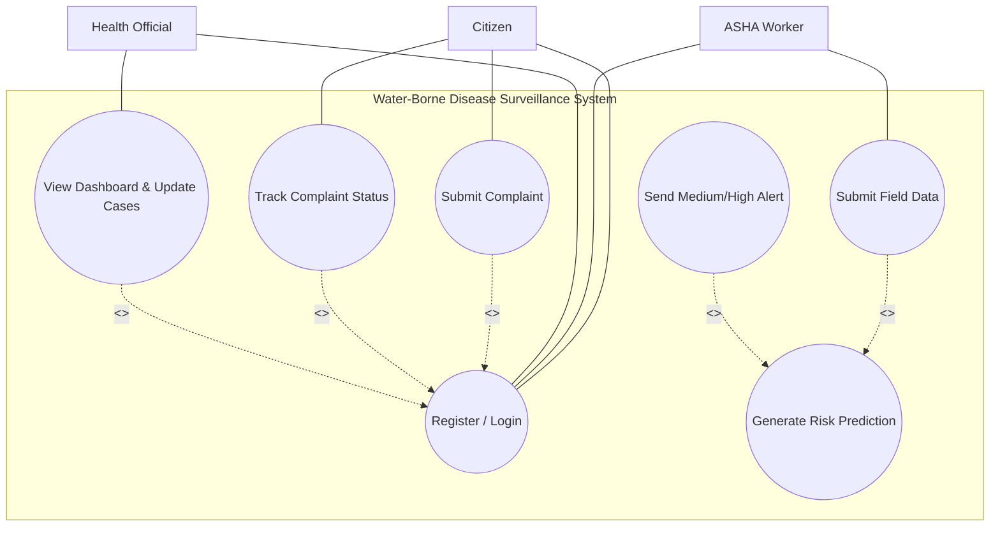
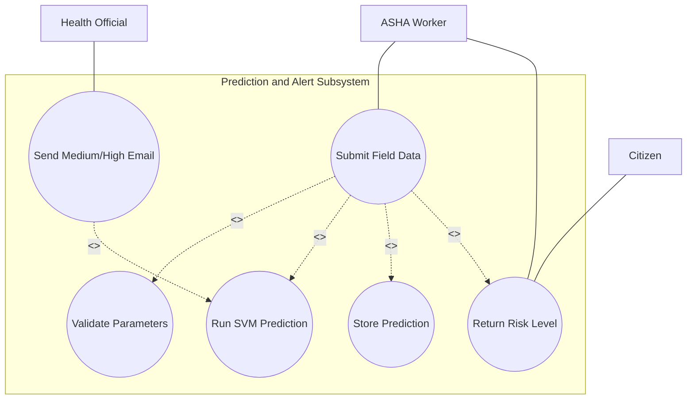

# Water-Borne Disease Surveillance System - Use Case Diagrams

## 1) UML Arrow Rules Used

Use these exact relation rules in standard UML use case diagrams:

- Actor association:
  - Solid line
  - Example: Citizen --> (Submit Complaint)
- Include:
  - Dashed arrow from base use case to mandatory reused use case
  - Label: <<include>>
  - Example: (Submit Complaint) ..> (Validate Complaint Data) : <<include>>
- Extend:
  - Dashed arrow from optional/conditional extension use case to base use case
  - Label: <<extend>>
  - Example: (Trigger High Risk Alert) ..> (Generate Risk Prediction) : <<extend>>

Rule summary:
- Use <<include>> for always-required behavior.
- Use <<extend>> for conditional behavior (only in some situations).

---

## 2) Main Use Case Diagram (All 3 Actors)

---

## 3) Risk Prediction Use Case (Include/Extend Focus)

This is the exact behavior implemented in your prediction endpoint:
- Input validation always happens.
- Model prediction always happens.
- Prediction record is always stored.
- Medium and High email notifications happen only conditionally.
- Low risk does not trigger email.

---

## 4) Mapping to Your Current Project Endpoints

Citizen:
- Register Account -> /api/local/register
- Login -> /api/local/login
- Submit Complaint -> /api/complaint/submit
- View Own Complaints, Track Status -> /api/complaints/<local_id>

ASHA Worker:
- Register ASHA Account -> /api/asha/register
- Login ASHA -> /api/asha/login
- Submit Field Data and Request Prediction -> /api/predict
- View Prediction History -> /api/asha/predictions
- View Area Complaints -> /api/asha/complaints

Health Official:
- Admin Login -> /api/admin/login
- View Dashboard Statistics -> /api/admin/stats
- View All Predictions -> /api/admin/predictions
- View All Complaints -> /api/admin/complaints
- View Registered Citizens -> /api/admin/locals
- View Registered ASHA Workers -> /api/admin/asha
- View Login Sessions -> /api/admin/sessions
- Update Complaint Status -> /api/admin/update_complaint_status/<id>
- Delete System Records -> /api/admin/delete/<type>/<id>
